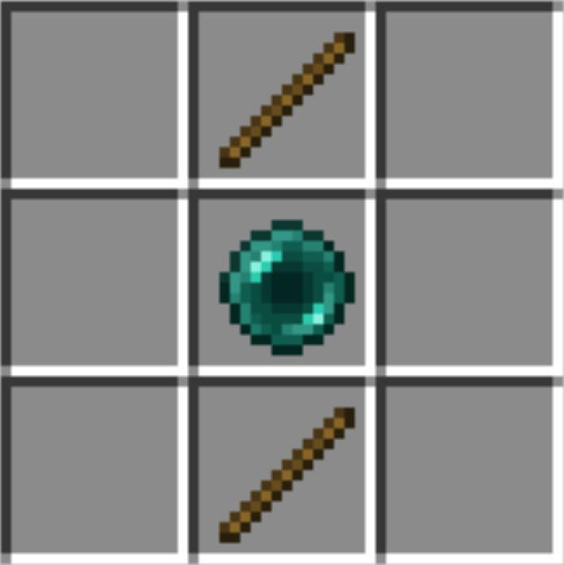

# EnderPlayers Minecraft Plugin

This is a plugin inspired by [Ranboo's](https://twitter.com/Ranboosaysstuff) character from the DreamSMP. He has the
unique ability to pick up block's similar to an Enderman. Download will likely be moved to the [SpigotMC website](https://spigotmc.org)
once the plugin is completely finished. This is my first somewhat legitimate plugin and github repository 
so all help/criticism is welcome and appreciated!

### Download the Plugin

[Click here](https://github.com/dirkwind/EnderPlayers/raw/main/PluginJar/EnderPlayers.jar) to download the latest version.

## Features

### Commands:

* **enderhands**
    * **Function:** sets the value of the specified target(s)'s enderhands value
    * **Description:** the enderhands power causes all block mined without an item the player's main hand will drop as is 
      (e.g. grass block will drop a grass block, stone will drop stone)
    * **Syntax:** /enderhands targets {true|false|toggle}
* **enderteleport**
    * **Function:** sets the value of the specified target(s)'s enderteleport value
    * **Description:** the enderteleport power allows a player holding a ***TP Stick*** in their main hand to teleport wherever
      they look by pressing their interact button.
    * **Syntax:** /enderteleport targets {true|false|toggle}
    
### Items:

* **TP Stick**
    * **Purpose:** used to allow players with the enderteleport power to teleport
    * **Crafting:** this item is crafted using 2 sticks and an ender pearl.
        
        
    
## Future Plans

**Note:** The exact time in which these will be completed has not been determined.

* ~~add player teleportation feature~~ *(completed)*
* add player water damage feature
* add config file for plugin customization